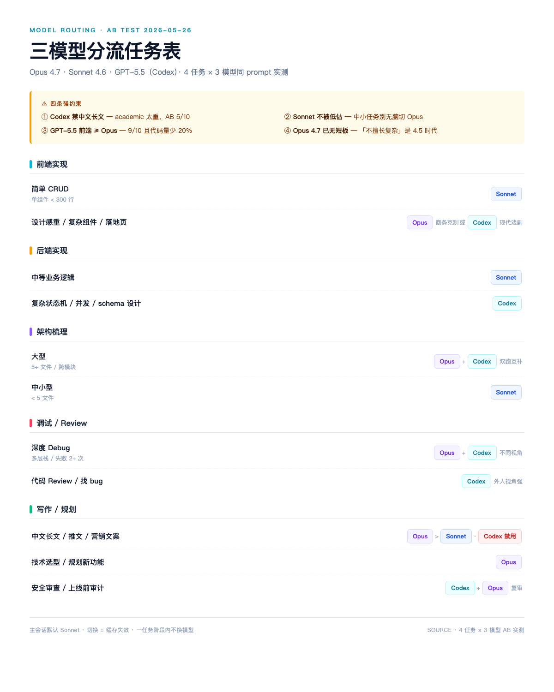

# Opus 4.7 vs Sonnet 4.6 vs Codex (GPT-5.5) — AB Test

> 4 任务 × 3 模型 × 同 prompt 互不参照实测。原起点：[leon7hao 这条](https://x.com/leon7hao/status/2059191435753410630) 关于「Opus 写前端 / GPT 写架构 / Codex 找 bug」的分工与日常手感对不上，跑一遍验证。
>
> English: [README.en.md](./README.en.md)



---

## 测试设计

3 个模型同 prompt 各跑一遍互不参照。Prompt 自包含（不依赖项目上下文），保证三模型起跑线一致。

| 任务 | 验证维度 | Prompt |
|------|---------|--------|
| T1 | FAQ Accordion HTML 组件 — 前端实现 + 视觉 | [prompts/t1-prompt.md](./prompts/t1-prompt.md) |
| T2 | 33 文件 Python 项目耦合扫描 — 架构识别深度 | [prompts/t2-prompt.md](./prompts/t2-prompt.md) |
| T3 | JS Promise 缓存竞态 debug — 根因定位 + 生产意识 | [prompts/t3-prompt.md](./prompts/t3-prompt.md) |
| T4 | R2 vs S3 中文推文 280-400 字 — 中文判断力 | [prompts/t4-prompt.md](./prompts/t4-prompt.md) |

每个模型的原始产出在 `outputs/<task>/<model>.<ext>`。

## 评分维度（按任务定）

- **T1** — 视觉风格 + 代码量 + 设计克制度（人眼比较截图 + 行数对比，截图见 `screenshots/t1-*.png`）
- **T2** — findings 总数 + 覆盖矩阵（谁抓到 / 谁漏什么）
- **T3** — 根因正确性 + 修复方案完整度 + 推理路径深度（是否有反向验证）
- **T4** — hook 力度 / 判断明确度 / X-native 度 / 禁词命中

T2 因为目标是私有项目，路径已 abstract 成 `<project>/`，但 finding 内容保留 — 你换成自己一个 5+ 文件项目即可复现。

## 关键发现（5 秒版）

| 任务 | 最优 | 备注 |
|------|------|------|
| 前端（复杂） | Opus / Codex 并列 9/10 | Codex 代码量比 Opus 少 20% |
| 架构（大型） | Opus 深度第一 | Codex 框架定性强但 finding 数少；Sonnet 抓到 Opus 漏的 mkdir / ghost imports |
| 深度 Debug | Opus（生产意识强）/ Codex 互补 | Opus 多出「img.src 移到 onload 后绑」这种真实生产坑 |
| 中文写作 | Opus 9 / Sonnet 8 / **Codex 5** | Codex 单段无 break、academic 腔，写推文禁用 |

完整评分矩阵 + leon7hao 8 条判断对照表 + 路由建议见 **[REPORT.md](./REPORT.md)**。

## 四条强约束（实测得出）

1. **Codex 禁中文长文** — academic 太重，AB 实测 5/10
2. **Sonnet 不被低估** — 中小任务别无脑切 Opus，T2 实测 Sonnet 比 Opus 抓到更多「低垂果实」
3. **GPT-5.5 前端 ≥ Opus** — 9/10 且代码量少 20%，「GPT 不擅长前端」过时
4. **Opus 4.7 已无短板** — 架构 / debug / 写作 / 前端四项都拿最高或并列最高分

## 文件结构

```
ab-test/
├── README.md / README.en.md
├── REPORT.md              完整评分矩阵 + leon7hao 判断对照 + 路由建议
├── prompts/               4 个 prompt 原文
├── outputs/
│   ├── t1-accordion/      3 模型 HTML 产出
│   ├── t2-arch/           3 模型架构 finding md
│   ├── t3-debug/          buggy.js（输入）+ 3 模型分析 md
│   └── t4-chinese/        source.md（事实卡）+ 3 模型推文 txt
└── screenshots/           T1 三模型渲染 + 路由表图
```

## 测试环境

| 模型 | 路径 | 订阅 |
|------|------|------|
| Opus 4.7 | Claude Code (`/model opus`) | Claude Max |
| Sonnet 4.6 | Claude Code (默认) | Claude Max |
| Codex GPT-5.5 | Codex CLI 0.133.0-alpha.1, `reasoning=high`, `-s read-only` | Codex Pro |

时间：2026-05-26
评分：人工

## 局限

- 4 任务 × 3 模型样本小，结论应该看作「方向性证据」而不是 benchmark
- 评分是人工（我自己），有主观成分；T2 / T3 的 finding 数和覆盖矩阵是相对客观的硬数据
- T2 prompt 指向的项目是私有，无法直接复现；其他三个 self-contained
- Codex 跑的是 `reasoning=high` + `read-only`；不同 reasoning 等级表现会不同
- 时间点 2026-05-26，模型在迭代，结论会过期

## License

MIT
